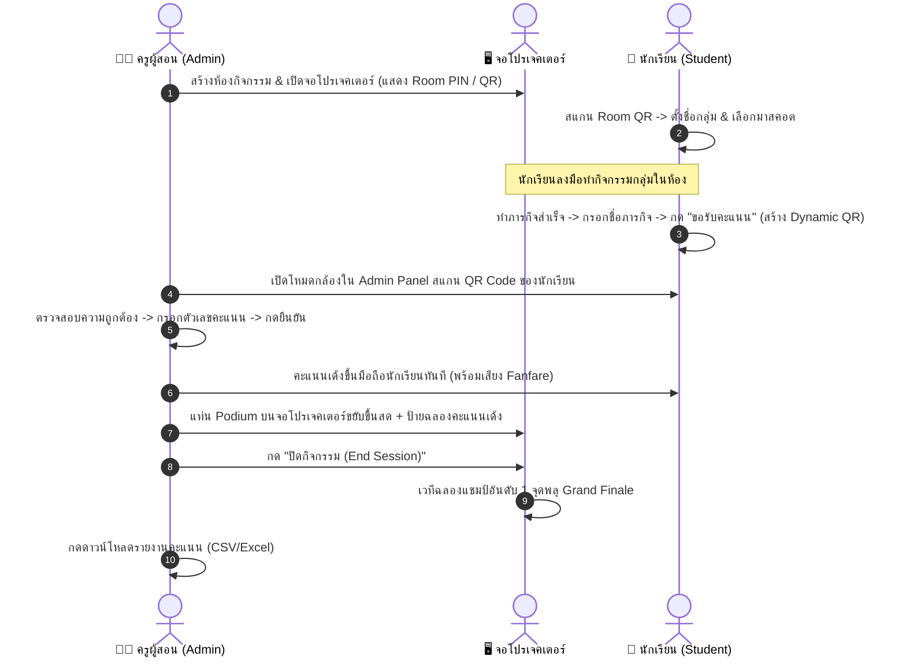

# 🏆 ระบบของครูซอส (Real-time Gamified Activity & Score Tracking System)
### พัฒนาสื่อการเรียนรู้ 2569 - โรงเรียนวัดบางปูน (รหัสโครงการ: TS005)

ระบบเว็บแอปพลิเคชันจัดการกิจกรรมกลุ่มในชั้นเรียนแบบเรียลไทม์ ใช้งานผ่านเว็บเบราว์เซอร์ได้ทันทีบนมือถือ แท็บเล็ต คอมพิวเตอร์ และจอโปรเจคเตอร์ ไม่ต้องดาวน์โหลดหรือติดตั้งแอปพลิเคชัน

---

## 🌟 ฟังก์ชันหลักและจุดเด่นของระบบ

1. **🌐 หน้าบ้าน (Frontend Web App)**:
   - **Admin Panel (ครูผู้สอน)**: จัดการห้อง, ควบคุมสถานะ (เริ่ม/พัก/จบ), กล้องสแกน Dynamic QR Code ของนักเรียนพร้อมเสียง Beep และปุ่มให้คะแนนด่วน (+5, +10, +20, +50, +100)
   - **Student Panel (กลุ่มนักเรียน)**: สแกนเข้าห้อง, ตั้งชื่อกลุ่ม, เลือกมาสคอตและสีประจำทีม, หน้าแดชบอร์ดคะแนนสด, ฟอร์มระบุภารกิจและสร้าง Dynamic QR Code ชั่วคราว
   - **Display Dashboard (จอโปรเจคเตอร์)**: แสดงแท่นรางวัล **Top 3 Podium** เคลื่อนไหวตามคะแนนสด, แสดงอันดับ 4+ พร้อมแถบหลอดคะแนน, ป้ายแจ้งเตือน Live Toast เด้งฉลองคะแนน, และ Room QR Code ขนาดใหญ่

2. **🔒 ระบบความปลอดภัย Dynamic QR Code & Anti-Replay**:
   - ระบบสร้าง QR Code ชั่วคราวที่ฝัง Token, Nonce, HMAC Checksum, และ Timestamp ที่มีเวลานับถอยหลัง
   - มีระบบตรวจสอบความถูกต้องและป้องกันการแคปภาพหน้าจอไปสแกนซ้ำ เมื่อครูสแกนให้คะแนนแล้ว Token จะถูกล็อกทันที

3. **⚡ ระบบ Real-time Engine**:
   - เชื่อมต่อผ่าน WebSockets (Socket.io) อัปเดตข้อมูลคะแนนและอันดับไปยังทุกหน้าจอ (มือถือนักเรียน, แอดมิน, จอโปรเจคเตอร์) ทันทีโดยไม่ต้องกดรีเฟรช

4. **🏁 โหมดปิดกิจกรรม (Grand Finale Summary & Report)**:
   - สรุปผลคะแนนอย่างเป็นทางการ เวทีฉลองแชมป์อันดับ 1 พร้อมเอฟเฟกต์จุดพลุ (Fireworks & Confetti)
   - ส่งออกรายงานคะแนนเป็นไฟล์ **Excel / CSV (รองรับภาษาไทย UTF-8 BOM)** และ JSON ละเอียดทุกภารกิจ

---

## 🚀 วิธีการเริ่มต้นใช้งาน (Quick Start)

### วิธีที่ 1: รันด้วย Batch Script บน Windows (ง่ายที่สุด)
ดับเบิลคลิกที่ไฟล์:
```text
เริ่มใช้งานระบบ_START.bat
```
เมื่อหน้าต่างเซิร์ฟเวอร์เปิดขึ้น สามารถเข้าใช้งานได้ที่ `http://localhost:3000`

### วิธีที่ 2: รันผ่าน Terminal / Command Line
```bash
# 1. ติดตั้ง Dependencies (ทำเฉพาะครั้งแรก)
npm install

# 2. คอมไพล์ Frontend
npm run build

# 3. รันระบบ
npm start
```
เปิดเบราว์เซอร์แล้วไปที่: `http://localhost:3000`

---

## 📱 ลำดับการใช้งานจริงในชั้นเรียน (User Flow)



---

## 📂 โครงสร้างโปรเจกต์

- `server/`
  - `index.js`: Express & Socket.io Real-time Event Server
  - `roomManager.js`: ตรรกะจัดการห้อง, การจัดอันดับ, และระบบ Anti-Replay QR
  - `db.js`: ระบบบันทึกข้อมูลถาวร (Rooms, Groups, Score Transactions)
  - `routes.js`: REST API สำหรับดาวน์โหลดรายงาน Excel/CSV
- `src/`
  - `pages/LandingPage.jsx`: หน้าแรกเลือกบทบาท ครู/นักเรียน/จอโปรเจคเตอร์
  - `pages/AdminPanel/`: ระบบจัดการห้อง, สแกนกล้อง, และให้คะแนน
  - `pages/StudentPanel/`: หน้าจอนักเรียน, ขอคะแนน, และลีดเดอร์บอร์ด
  - `pages/DisplayDashboard/`: หน้าจอโปรเจคเตอร์, Top 3 Podium, และ Grand Summary
  - `components/AudioController.js`: ตัวสร้างเสียงสังเคราะห์ Web Audio API (Beep, Point Gain, Fanfare)
  - `components/ConfettiEffect.jsx`: เอฟเฟกต์พลุฉลองความสำเร็จ

---

## 🏆 ผลงานการพัฒนา
จัดทำสำหรับ: **คุณครูซอส**  
หน่วยงาน: **โรงเรียนวัดบางปูน**  
ปีการศึกษา: **2569**
